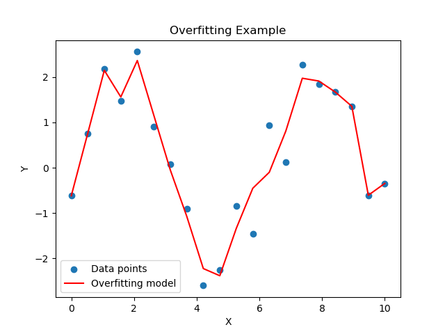
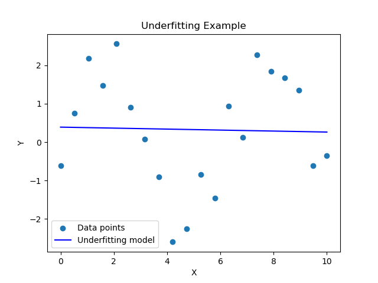

\title{MLT Week-11}
\author{Sherry Thomas \\ 21f3001449}

\maketitle
\tableofcontents

\begin{abstract}
This week's curriculum entails a further examination of the perceptron algorithm, followed by a comprehensive exploration of support vector machines (SVM) and subsequently, an elaboration on the concept of soft-margin SVM.
\end{abstract}

# Dual Formulation for Soft-Margin SVM

The primal formulation for Soft-Margin SVM is given by,
$$
\min_{w, \epsilon}  \frac{1}{2}||w||^2_2 + C\sum _{i=1} ^n\epsilon_i \quad s.t. \quad (w^Tx_i)y_i + \epsilon_i \ge 1;\quad \epsilon_i \ge 0\quad \forall i
$$
where $C$ is the hyperparameter that is used to balance the trade-off between maximizing the margin and minimizing the number of misclassifications, and $\epsilon_i$ is the additional value required to satisy the constraints.

The Lagrangian function $\mathcal{L}(w, \epsilon, \alpha, \beta)$ for our above function is defined as follows:
$$
\mathcal{L}(w, \epsilon, \alpha, \beta) = \frac{1}{2}||w||^2_2 + C\sum _{i=1} ^n\epsilon_i + \sum _{i=1} ^n \alpha_i(1-(w^Tx_i)y_i - \epsilon_i) + \sum _{i=1} ^n \beta(-\epsilon_i)
$$
where $\alpha_i \ge 0$ and $\beta_i \ge 0$ $\forall i$.

## Dual Formulation

Maximizing the Lagrangian function w.r.t. $\alpha$ and $\beta$, and minimizing it w.r.t. $w$ and $\epsilon$, we get,

$$
\min _{w, \epsilon}\left [\max _{\alpha \ge 0; \beta \ge 0}\frac{1}{2}||w||^2_2 + C\sum _{i=1} ^n\epsilon_i + \sum _{i=1} ^n \alpha_i(1-(w^Tx_i)y_i - \epsilon_i) + \sum _{i=1} ^n \beta(-\epsilon_i) \right ]
$$

The dual of this is given by,

$$
\max _{\alpha \ge 0; \beta \ge 0}\left [\min _{w, \epsilon}\frac{1}{2}||w||^2_2 + C\sum _{i=1} ^n\epsilon_i + \sum _{i=1} ^n \alpha_i(1-(w^Tx_i)y_i - \epsilon_i) + \sum _{i=1} ^n \beta(-\epsilon_i) \right ]
$$

$$
\max _{\alpha \ge 0; \beta \ge 0}\left [\min _{w, \epsilon}\mathcal{L}(w, \epsilon, \alpha, \beta) \right ] \quad \ldots[1]
$$

Differentiating the above function$[1]$ w.r.t. $w$ while fixing $\alpha$ and $\beta$, we get,
$$
\frac{d\mathcal{L}}{dw}  = 0 
$$
$$
\frac{d}{dw} \frac{1}{2}||w||^2_2 + C\sum _{i=1} ^n\epsilon_i + \sum _{i=1} ^n \alpha_i(1-(w^Tx_i)y_i - \epsilon_i) + \sum _{i=1} ^n \beta(-\epsilon_i) = 0\\
$$
$$
w_{\alpha, \beta}^* - \alpha_ix_iy_i = 0
$$
$$
\therefore w_{\alpha, \beta}^* = \alpha_ix_iy_i \quad \ldots [2]
$$

Differentiating the above function$[1]$ w.r.t. $\epsilon_i \forall i$ while fixing $\alpha$ and $\beta$, we get,

$$
\frac{\partial\mathcal{L}}{\partial\epsilon_i}  = 0 
$$
$$
\frac{\partial}{\partial\epsilon_i} \frac{1}{2}||w||^2_2 + C\sum _{i=1} ^n\epsilon_i + \sum _{i=1} ^n \alpha_i(1-(w^Tx_i)y_i - \epsilon_i) + \sum _{i=1} ^n \beta(-\epsilon_i) = 0 
$$
$$
C - \alpha_i -\beta_i = 0
$$
$$
\therefore C = \alpha_i + \beta_i \quad \ldots [3]
$$

Substituting the values of $w$ and $\beta$ from $[2]$ and $[3]$ in $[1]$, we get,

$$
\max _{\alpha \ge 0; \beta \ge 0; C = \alpha_i + \beta_i}\left [\frac{1}{2}||\alpha_ix_iy_i||^2_2 + C\sum _{i=1} ^n\epsilon_i + \sum _{i=1} ^n \alpha_i(1-((\alpha_ix_iy_i)^Tx_i)y_i - \epsilon_i) + \sum _{i=1} ^n (C-\alpha_i)(-\epsilon_i) \right ]
$$
$$
\max _{\alpha \ge 0; \beta \ge 0; C = \alpha_i + \beta_i}\left [\frac{1}{2}\alpha_i^Tx_i^Ty_i^Ty_ix_i\alpha_i + C\sum _{i=1} ^n\epsilon_i + \sum _{i=1} ^n \alpha_i-\alpha_i^Tx_i^Ty_i^Ty_ix_i\alpha_i - \sum _{i=1} ^n \alpha_i\epsilon_i - C\sum _{i=1} ^n\epsilon_i + \sum _{i=1} ^n \alpha_i\epsilon_i \right ]
$$
$$
\max _{\alpha \ge 0; \beta \ge 0; C = \alpha_i + \beta_i}\left [\sum _{i=1} ^n \alpha_i - \frac{1}{2}\alpha_i^Tx_i^Ty_i^Ty_ix_i\alpha_i\right ]
$$
$$
\therefore \max _{0 \le \alpha \le C}\left [\sum _{i=1} ^n \alpha_i - \frac{1}{2}\alpha_i^Tx_i^Ty_i^Ty_ix_i\alpha_i\right ]
$$
If $C=0$, $\alpha^*=0$ $\rightarrow$ $\displaystyle w^*=\sum _{i=1} ^n \alpha^*_i x_i y_i = 0$.

if $C=\infty$, the equation will be equal to that of Hard-Margin SVM.

## Complementary Slackness in Soft-Margin Support Vector Machines

Complementary slackness can be expressed through a set of equations as follows:

1. $\forall i$, the following equation holds:
   $$
   \alpha_i(1 - \mathbf{w}^{*T}\mathbf{x}_i y_i - \epsilon^*_i) = 0 \quad \ldots [1]
   $$

2. Additionally, the following relation must hold:
   $$
   \beta_i(\epsilon_i^*) = 0 \quad \ldots [2]
   $$

Given these equations, various scenarios arise which elucidate the implications of complementary slackness in the context of Soft-Margin SVM.

### Scenarios of Complementary Slackness

1. If $\alpha_i^* = 0$:\
In this case, $\beta_i^* = C$ due to $\alpha_i^* + \beta_i^* = C$. From equation [2], we deduce that $\epsilon_i^* = 0$. Consequently, it follows that the decision function $(\mathbf{w}^{*T}\mathbf{x}_i)y_i + \epsilon_i^* \ge 1$ simplifies to $(\mathbf{w}^{*T}\mathbf{x}_i)y_i \ge 1$, indicating that the data point is correctly classified and lies outside the margin.

2. If $0 < \alpha_i^* < C$:\
In this scenario, both $\alpha_i^*$ and $\beta_i^*$ assume positive values within the range $(0, C)$. Equation [2] implies $\epsilon_i^* = 0$, while equation [1] gives $1 - \mathbf{w}^{*T}\mathbf{x}_i y_i - \epsilon^*_i = 0$, leading to $(\mathbf{w}^{*T}\mathbf{x}_i)y_i = 1$. This signifies that the data point resides exactly on the margin boundary.

3. If $\alpha_i^* = C$:\
When $\alpha_i^*$ takes on the maximum value $C$, the dual variable $\beta_i^*$ becomes $0$. Equation [2] establishes that $\epsilon_i^*\ge0$. Equation [1] implies $1 - \mathbf{w}^{*T}\mathbf{x}_i y_i - \epsilon^*_i = 0$, which further simplifies to $1 - \mathbf{w}^{*T}\mathbf{x}_i y_i = \epsilon^*_i$. This results in $1 - \mathbf{w}^{*T}\mathbf{x}_i y_i \ge 0$, indicating that the data point is misclassified or lies within the margin.

4. If $(\mathbf{w}^{*T}\mathbf{x}_i)y_i < 1$:\
Given that $(\mathbf{w}^{*T}\mathbf{x}_i)y_i < 1$, the inequality $(\mathbf{w}^{*T}\mathbf{x}_i)y_i + \epsilon_i^* \ge 1$ holds. By manipulating this inequality, we deduce $\epsilon_i^* > 0$. From equation [2], it follows that $\beta_i^* = 0$, and consequently, $\alpha_i^* = C$.

5. If $(\mathbf{w}^{*T}\mathbf{x}_i)y_i = 1$:\
For data points that satisfy $(\mathbf{w}^{*T}\mathbf{x}_i)y_i = 1$, we once again consider the inequality $(\mathbf{w}^{*T}\mathbf{x}_i)y_i + \epsilon_i^* \ge 1$, leading to $\epsilon_i^* \ge 0$. If $\epsilon_i^* > 0$, equation [2] indicates $\beta_i^* = 0$, resulting in $\alpha_i^* = C$. On the other hand, if $\epsilon_i^* = 0$, equation [2] implies $\beta_i^* \ge 0$, and as a consequence, $\alpha_i^* \in [0, C]$.

6. If $(\mathbf{w}^{*T}\mathbf{x}_i)y_i > 1$:\
When $(\mathbf{w}^{*T}\mathbf{x}_i)y_i > 1$, the inequality $1 - \mathbf{w}^{*T}\mathbf{x}_i y_i - \epsilon^*_i < 0$ holds. From equation [1], we conclude that $\alpha_i^* = 0$, leading to $\beta^*_i = C$ as per the equation $\alpha_i^* + \beta_i^* = C$. Furthermore, equation [2] reveals that $\epsilon_i^* = 0$.

### Summary of Scenarios

In summary, we have established the following relationships between the dual variable $\alpha_i^*$ and the decision boundary defined by $(\mathbf{w}^{*T}\mathbf{x}_i)y_i$:

- $\alpha_i^* = 0$: Data point is correctly classified and outside the margin.
- $0 < \alpha_i^* < C$: Data point lies exactly on the margin boundary.
- $\alpha_i^* = C$: Data point is misclassified or inside the margin.
- $(\mathbf{w}^{*T}\mathbf{x}_i)y_i < 1$: Dual variable $\alpha_i^* = C$.
- $(\mathbf{w}^{*T}\mathbf{x}_i)y_i = 1$: Dual variable $\alpha_i^* \in [0, C]$ if $\epsilon_i^* = 0$, else $\alpha_i^* = C$.
- $(\mathbf{w}^{*T}\mathbf{x}_i)y_i > 1$: Dual variable $\alpha_i^* = 0$.

# Overfitting and Underfitting
## Overfitting
- **Definition:** Overfitting occurs when a model excessively tailors itself to the training data, capturing not only the underlying structure but also the noise present in the data.
- **Characteristics:** The model's complexity is high, fitting noise and data irregularities.
- **Resultant Error:** High training error and significantly higher test error.
- **Bias-Variance Trade-off:** High variance due to sensitivity to data fluctuations, causing large discrepancies in predictions for different datasets.
- **Bias:** Generally low, as the model captures intricate patterns, but it tends to fit noise.
- **Variance:** High due to excessive flexibility, leading to instability in predictions.

## Underfitting
- **Definition:** Underfitting occurs when a model is too simplistic to capture the underlying structure of the data, mistaking meaningful patterns for noise.
- **Characteristics:** The model's complexity is low, missing out on key relationships and details.
- **Resultant Error:** Both training and test error are high.
- **Bias-Variance Trade-off:** High bias as the model oversimplifies, causing consistent errors across datasets.
- **Bias:** High as the model fails to capture relevant data patterns.
- **Variance:** Low as the model's simplicity leads to stable predictions, but they are consistently incorrect due to the lack of complexity.

## Bias-Variance Tradeoff
**Bias-Variance Trade-off Definition:**
The bias-variance trade-off is the delicate balance between a model's ability to fit training data (bias) and its generalization performance on unseen data (variance).

**Formula:**
$$
\text{Error} = \text{Bias}^2 + \text{Variance} + \text{Irreducible Error}
$$

where **$\text{Irreducible Error}$** refers to the inherent noise and variability present in any real-world data. It is the part of the prediction error that cannot be reduced by improving the model's complexity or using more advanced techniques. This error stems from factors beyond the scope of the model, such as measurement inaccuracies, inherent randomness, or unaccounted external influences. In essence, it represents the minimum achievable error regardless of the model's complexity, forming a theoretical limit to prediction accuracy.

# Ensemble Methods
Ensemble methods in machine learning involve combining multiple individual models to form a stronger predictive model. By aggregating diverse predictions, these methods aim to enhance generalization and performance. Popular techniques include bagging, boosting, and stacking, contributing to improved model robustness and accuracy.

## Bagging
**Bagging (Bootstrap Aggregating):** A machine learning ensemble technique that improves model stability and generalization by training multiple instances of the same model on different subsets of the training data, and then aggregating their predictions.

Let $D=\{(\mathbf{x}_1, y_1), \ldots, (\mathbf{x}_n,y_n)\}$ represent the dataset, where $\mathbf{x}_i \in \mathbb{R}^d$, $\mathbf{x}_i\sim\mathcal{N}(\mu, 1)$ and $y_i \in \{0, 1\}$.